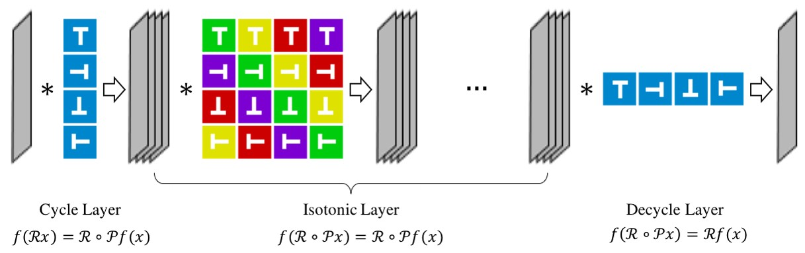

# DREN_TensorFlow
Paper Link:[Deep Rotation Equivirant Network](https://arxiv.org/abs/1705.08623)


Caffe version code:[https://github.com/microljy/DREN](https://github.com/microljy/DREN)
## Usage
### Requirements
- Install [TensorFlow](https://www.tensorflow.org/). Note that TensorFlow 0.12.0 is not supported.
- Install matlab for preprocessing Rotated-MNIST.

### Rotated-MNIST
#### Data
First, download the data and do preprocessing.

	cd DREN_ROOT/data/rmnist
	sh get_data.sh
	matlab < data_preprocess.m
	python generate_npy.py
	rm data.mat

#### Training
You can train the model with this command.

	python train_rmnist.py --model [MODEL_NAME]

The params ```MODEL_NAME``` could be ```z2cnn```,```dren_z2cnn``` or ```dren_z2cnn_x4```.

#### Result

|model         |error |
|--------------|------|
|Z2CNN         |4.58% |
|DREN_Z2CNN    |3.08% |
|DREN_Z2CNN_x4 |**1.76%** |

### Cifar-10
#### Data
First, download the data and do preprocessing.

	cd data/cifar-10
	wget http://www.cs.toronto.edu/~kriz/cifar-10-python.tar.gz
	tar -zxvf cifar-10-python.tar.gz
	rm cifar-10-python.tar.gz

#### Training
You can train the model with this command.

	python train_rmnist.py --model [MODEL_NAME]

The params ```MODEL_NAME``` could be ```resnet20```,```dren_resnet20_2b``` or ```dren_resnet20_2b_x4```.


#### Result

|model             |error |
|------------------|------|
|Resnet-20         |9.00% |
|DREN_Resnet-20    |8.51% |
|DREN_Resnet-20_x4 |**7.17%** |

## Discussion
DREN can be used to boost the performance of classification of images that have rotation symmetry, such as aerial image, microscope images, CT images and so on. We have tested the DREN in lung nodule detection and found it helpful.

## Citation
Please cite DREN in your publications if it helps your research:

	@article{Li2017Deep,
	  title={Deep Rotation Equivariant Network},
	  author={Li, Junying and Yang, Zichen and Liu, Haifeng and Deng, Cai},
	  journal={Neurocomputing},
	  volume={290},
	  pages={26-33},
	  year={2017},
	}
